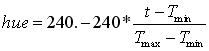
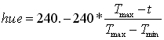

# The Scenario
You have run a temperature simulation of a 3D room that has 4 heat sources. You are given the temperature data from the simulation at each node in a 3D grid. You will be creating several visualizations (in Projects 2, 3, 4, and 5) to understand the distribution of temperatures within the 3D room.

# Requirements:
Put this project number and your name in the title bar.  
The information on the temperature distribution is the same as in Project #2.  
Display the temperature data as a colored point cloud.  
Use four GLUI range sliders to allow the user to cull the data by displaying a subset in X, Y, Z, and Temperature.
Use a fifth GLUI range slider to allow the user to reduce the data by checking its distance from the center of the cube (0.,0.,0.).  
Use a sixth range slider to control the display based on the absolute gradient at each point. The gradient at each point is a 3-component vector: (dT/dx,dT/dy,dT/dz). The absolute gradient is: sqrt( SQR(dTdx) + SQR(dTdy) + SQR(dTdz) ).   
This will show where the temperature is changing quickly and where it is changing slowly.
The x gradient at a point is obtained by taking the difference from the point before to the point after. This is called a two-sided gradient computation:  

Nodes[i][j][k].dTdx = ( Nodes[i+1][j][k].T - Nodes[i-1][j][k].T ) / ( Nodes[i+1][j][k].x - Nodes[i-1][j][k].x );  

The y and z gradients are similar. Be sure to take into account when i, j, or k are either 0 or at their maximum value. This is when you would use a one-sided gradient compuutation.  

The radius and the gradient are known as derived data. That is, they are not part of the dataset as it was given, but have been computed from that dataset.  

Setting up the Data in your Program  
If you are comfortable with structures, a 3D array of structures is a good way to store and access the data for this project:  
```cpp
struct node
{
        float x, y, z;          // location
        float T;                // temperature
	float r, g, b;		// the assigned color
        float rad;              // radius
	float dTdx, dTdy, dTdz;	// can store these if you want, or not
        float grad;             // total gradient
};

struct node  Nodes[NX][NY][NZ];
```
If you are not comfortable with C structures, a 3D array for X, a 3D array for Y, etc. will work too.  

The InitGraphics( ) function is a good place to set all these values. Fill the (x,y,z) components of each structure in the 3D array, use those (x,y,z) to compute a temperature, use the temperature to compute a color, and also use those (x,y,z) to compute the radius and the gradient.  

Using the GLUI Range Sliders  
We have added range sliders to the GLUI library. Here is how to use them.  

For each variable, define a text-display format, a 2-element array to hold the low and high end of the range, a pointer to the created slider, and a pointer to the created text-display:  


```cpp
// in the global variables:
#define TEMP	0
const float 		TEMPMIN = {   0. };
const float 		TEMPMAX = { 100. };
const char *		TEMPFORMAT = { "Temperature: %5.2f - %5.2f" };
float			TempLowHigh[2];
GLUI_HSlider *		TempSlider;
GLUI_StaticText *	TempLabel;
. . .


// in the function prototypes:
void	Buttons( int );
void	Sliders( int );
. . .


// in InitGlui( ):
	char str[128];
	. . .
	TempSlider = Glui->add_slider( true, GLUI_HSLIDER_FLOAT, TempLowHigh,
		TEMP, (GLUI_Update_CB) Sliders );
	TempSlider->set_float_limits( TEMPMIN, TEMPMAX );
	TempSlider->set_w( 200 );		// good slider width
	sprintf( str, TEMPFORMAT, TempLowHigh[0], TempLowHigh[1] );
	TempLabel = Glui->add_statictext( str );
```
The arguments to Glui->add_slider( ) are, in order:  
| range_slider | true means this is a 2-edged range slider                       |
|--------------|-----------------------------------------------------------------|
| type         | Use GLUI_HSLIDER_FLOAT                                          |
| array        | 2-element float array to store values in                        |
| id           | unique id to be passed into the callback routine (0, 1, 2, ...) |
| callback     | callback routine to call when a slider is used                  |

The arguments to TempSlider->set_float_limits( ) are the minimum and maximum values on that slider.   

The argument to TempSlider->set_w( ) is the width, in pixels, of that slider in the GLUI window. 200 is a good number.  

The argument to Glui->add_statictext( ) is the text string to display.  

# The Button Callback Routine
The buttons callback routine needs to be modified do re-do all the text strings if the Reset button is selected:  

```cpp
void
Buttons( int id )
{
        char str[256];

        switch( id )
        {
                case RESET:
                        Reset( );
                        sprintf( str, TEMPFORMAT, TempLowHigh[0], TempLowHigh[1] );
                        TempLabel->set_text( str );
			. . .
```
# The Slider Callback Routine  
All range sliders can use the same callback routine:  

```cpp
void
Sliders( int id )
{
        char str[32];

        switch( id )
        {
                case TEMP:
                        sprintf( str, TEMPFORMAT, TempLowHigh[0], TempLowHigh[1] );
                        TempLabel->set_text( str );
                        break;

		. . .
	}

        glutSetWindow( MainWindow );
        glutPostRedisplay( );
}
```

# In the Display( ): Function  
Note that you can't use display lists as easily as you did in Project #2. (Why?) Therefore, it is easiest if you redraw all the points in Display( ). However, you can at least save some compute time by pre-computing each point's (x,y,z) location, its color, its radius, and its gradient in the InitGraphics( ) function..  

Then, in Display( ) all you need to do is:  

```cpp
glPointSize( ?? );
glBegin( GL_POINTS );
for( int i = 0; i < NX; i++ )
{
  if( Nodes[i][j][k].x < XLowHigh[0]  ||  Nodes[i][j][k].x > XLowHigh[1] )
    continue;

  for( int j = 0; j < NY; j++ )
  {
    ?????

    for( int k = 0; k < NZ; k++ )
    {
	?????

	// check the radius too:

	?????

	// check the gradient too:

	?????

	// finally draw the point if it passes all the tests:

	glColor3f(  Nodes[i][j][k].r, Nodes[i][j][k].g, Nodes[i][j][k].b );
	glVertex3f( Nodes[i][j][k].x, Nodes[i][j][k].y, Nodes[i][j][k].z );
    }
  }
}
glEnd( ); 
```
# Suggestions:  
Feel free to use whatever color scale you find most insightful. One way of doing the color variation is to march from blue through green to red around the top of the HSV color cone. Feel free to use the HsvRgb( ) function. One way to map scalar values to this range is by setting saturation to 1.0, setting value to 1.0, and setting hue to:
  
or  
    
so that the whole calling sequence could look like:

```cpp
float hsv[3], rgb[3];
. . .
hsv[0] = 240. - . . .
hsv[1] = 1.;
hsv[2] = 1.;
HsvRgb( hsv, rgb );
glColor3f( rgb[0], rgb[1], rgb[2] );
or, more conveniently,
glColor3fv( rgb );
```