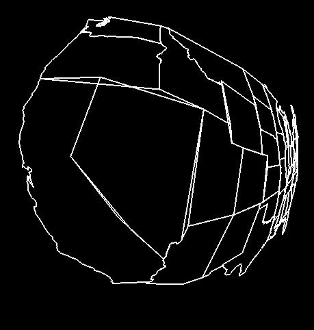
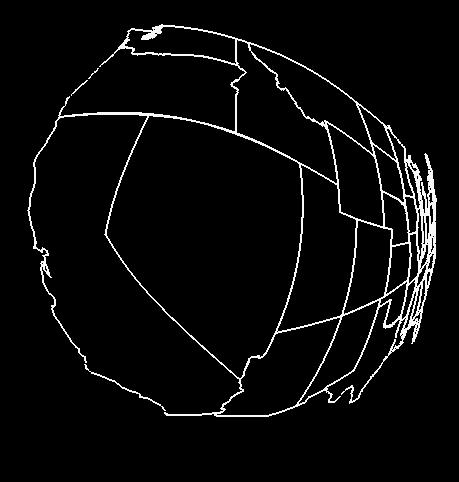

# Requirements:
Put this project number and your name in the title bar.  
Using hyperbolic geometry, draw a map of the United States (or something else of your own choosing)  
Allow the user to interactively translate the map.  
Use a GLUI spinner or one-handle slider (first argument = false) to change the value of K.   
GLUI_HSlider * KSlider = Glui->add_slider( false, GLUI_HSLIDER_FLOAT, &Kvalue, 0, (GLUI_Update_CB) Sliders );  
Toggle between polar and Cartesian hyperbolic transformations with a checkbox.  
# Applying The Hyperbolic Geometry Equations:  
For each original Cartesian coordinate pair (x,y):  

Translate the original x,y by the current translation amount to create a new x',y'.   
Do this by adding the translation values to create a new x.y.   
x' = x + Tx   
y' = y + Ty   
Don't do it with glTranslatef( ).  
For Hyperbolic-Polar:  
Compute the x',y' polar coordinate radius, r'.   
r' = sqrt( x'2 + y'2 )  
Do not use atan2( ) to get the polar coordinate angle. Instead, get just the cosine and sine of that angle by dividing:   
costheta = x'/r'   
sintheta = y'/r'  
Perform the hyberbolic transform on the polar coordinate radius to produce r''.   
r'' = r' / (r'+K)  
Use that cosine and sine to convert from polar coordinates back to Cartesian.   
x'' = r'' * costheta = r'/(r'+K) * (x'/r') = x'/(r'+K)   
y'' = r'' * sintheta = r'/(r'+K) * (y'/r') = y'/(r'+K)  
For Hyperbolic-Cartesian, use:   
x'' = x' / sqrt( x'*x' + K*K )   
y'' = y' / sqrt( y'*y' + K*K )  
Then plot that new (x'',y'') point.  
# Reading and Storing the United States Data  
The state outlines are in a file called proj04.dat. Click here to get it.  
The outlines consist of 68 linestrips. In the file, each linestrip is defined by an integer, N, followed by N X, Y coordinate pairs, then another N, then another N pairs, and so on. The largest N is 263.  
The range of X in the data file is -36.65 to 36.65 and the range of Y is -22.65 to 22.65. The coordinate units of the X, Y pairs is unimportant for this application. They have been converted from latitude-longitude to Universal Transverse Mercator projection to minimize distortion.  
One way to handle this is with a 2D array that is sized for the largest N:  
```cpp
int   Npts[68];
float X[68][263];
float Y[68][263];


<< in InitGraphics( ): >>

FILE *fp = fopen( "proj04.dat", "r" );
if( fp == NULL )
{
	fprintf( stderr, "Cannot open 'proj07.dat' !\n" );
	exit( 1 );
}

for( int i = 0; i < 68; i++ )
{
	fscanf( fp, "%d", &Npts[i] );
	for( int j = 0; j < Npts[i]; j++ )
	{
		fscanf( fp, "%f %f", &X[i][j], &Y[i][j] );
	}
}
fclose( fp );


<< In Display( ): >>

for( int i = 0; i < 68; i++ )
{
	glBegin( GL_LINE_STRIP );
	for( int j = 0; j < Npts[i]; j++ )
	{
		?????
		glVertex2f( ??, ?? );
	}
	glEnd( );
}
```

Another way to handle this is with C structures and dynamic memory allocation:  
```cpp
struct xy
{
	float x, y;
};

int        Npts[68];
struct xy *Outlines[68];


<< in InitGraphics( ): >>

FILE *fp = fopen( "proj04.dat", "r" );
if( fp == NULL )
{
        fprintf( stderr, "Cannot open 'proj07.dat' !\n" );
        exit( 1 );
}

for( int i = 0; i < 68; i++ )
{
	fscanf( fp, "%d", &Npts[i] );
	Outlines[i] = (struct xy *) malloc( Npts[i] * sizeof(struct xy) );

	for( int j = 0; j < Npts[i]; j++ )
	{
		fscanf( fp, "%f %f", &Outlines[i][j].x, &Outlines[i][j].y );
	}
}


<< In Display( ): >>

for( int i = 0; i < 68; i++ )
{
	glBegin( GL_LINE_STRIP );
	for( int j = 0; j < Npts[i]; j++ )
	{
		?????
		glVertex2f( ??, ?? );
	}
	glEnd( );
}
```

Another way to handle this is with a C++ class, dynamic memory allocation, and a Display( ) method for that class:  
```cpp
struct xy
{
	float x, y;
};

class Linestrip
{
  public:
	int npts;		// # of points in the line strip
	struct xy *pts;		// array of point structures

	// constructor:

	Linestrip( int n = 100 )
	{
		npts = n;
		pts = new struct xy[n];
	}


	// method to display the linestrip:

	void
	Display( )
	{
		glBegin( GL_LINE_STRIP );
		for( int i = 0; i < npts; i++ )
		{
			?????
			glVertex2f( ??, ?? );
		}
		glEnd( );
	}

};

	. . .

Linestrip  *Outlines[68];	// 68 linestrips in usa map

	. . .

<< In InitGraphics( ): >>

FILE *fp = fopen( "proj04.dat", "r" );
if( fp == NULL )
{
        fprintf( stderr, "Cannot open 'proj07.dat' !\n" );
        exit( 1 );
}

for( int i = 0; i < 68; i++ )
{
	fscanf( fp, "%d", &npts );
	Outlines[i] = new Linestrip( npts );
	for( int j = 0; j < npts; j++ )
	{
		fscanf( fp, "%f %f", &Outlines[i]->pts[j].x, &Outlines[i]->pts[j].y );
	}
}


<< In Display( ): >>

	for( int i = 0; i < 68; i++ )
	{
		Outlines[i]->Display( );
	}
```


# Suggestions:
As this is a pure 2D application:  

* Use gluOrtho2D( -1., 1., -1., 1. ) to define the viewing area instead of glOrtho( ) or gluPerspective( ).
* Use glVertex2f( ) instead of glVertex3f( ).
* Do not use gluLookAt( ).
* Do not do make any calls to glRotatef( ), glTranslatef( ), or glScalef( )!
* Disable depth buffering at the beginning of Display( ): glDisable( GL_DEPTH );

+5 Points Extra Credit:
Because hyperbolic geometry uses a nonlinear equation, but we are drawing long lines, you get display cracks where there are T-intersections in the model, like this:  
  
Break each line segment into many line segments so that long straight lines appear curved as shown here:  
  

x = (1.-t) * x0  +  t * x1  
y = (1.-t) * y0  +  t * y1   
0. <= t <= 1.  